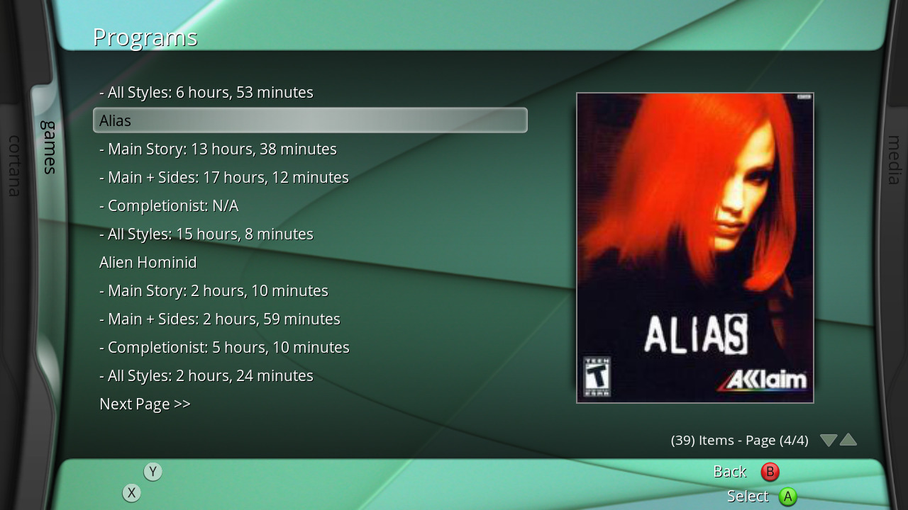

# plugin.programs.HLTB
How Long To Beat plugin for XBMC4Xbox.

## How to Use:
- Download the latest release .zip
- Copy the "xHLTB" folder to "Q:/plugins/programs"
- Launch the add-on from Program Add-Ons, and wait as it caches (this may take a while on first boot depending on how many games you have installed on your system)
- Select a game (or it's HLTB time) to directly launch and play it!
- You can modify settings such as cache file location, games.txt file location, and amount of games per page via the plugin settings! Note that setting the games per page value too high may lead to the add-on taking longer than expected to fetch each page, especially if you don't already have a cache file generated from first boot.

## Bugs:
- Some games, if not formatted correctly in games.txt, don't show up in HLTB. You'll have to manually fix these entries and regenerate the cache file! This will hopefully be a non-issue whenever I get MyPrograms6.db working.

## TODO:
- Use MyPrograms6.db instead of a pre-generated games.txt (cleaner and requires less work for the end user, but opening SQL databases on XBMC usually crashes the console)
- Clean up visual language.
- Alphabetical pagination?
- "Random" button that launches a random game!
